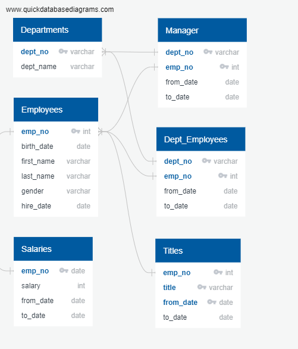
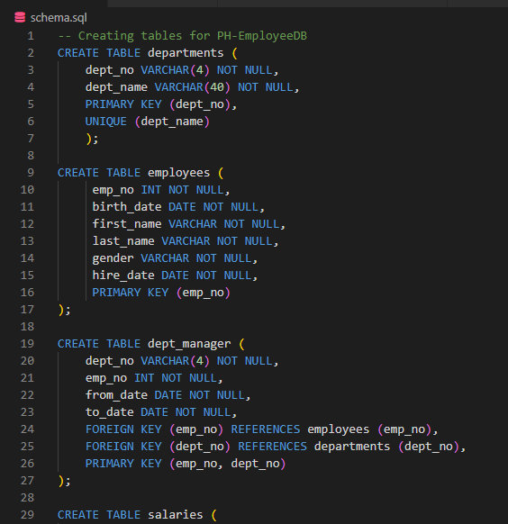
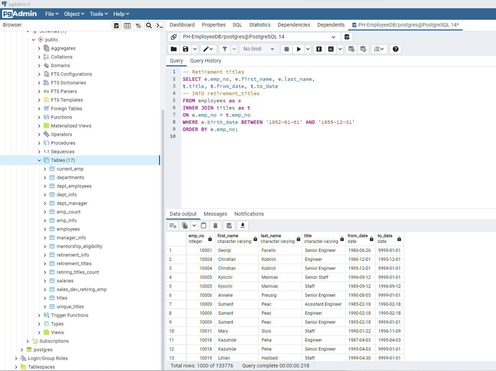
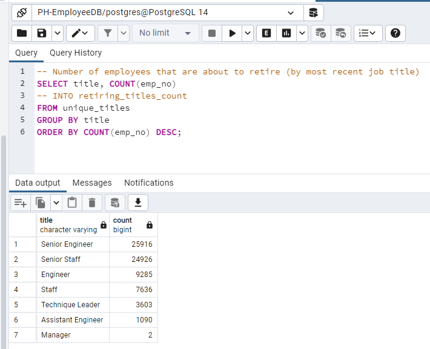

# Overview  
  
I am helping Bobby's manager prepare for the upcoming "silver tsunami" as many current employees reach retirement age.
("The silver tsunami is a metaphore used to describe an expected boom  in the senior population")  
  
In this project, I will help Bobby build an employee database with *SQL* by applying my *data modeling*, *engineering*, and *analysis skills*.  
  
  
## Scenario
  
Pewlett Hackard is a large company boasting several thousand employees and its been around for a long time.  
As baby boomers begin to retire at a rapid rate, PH is looking toward the future.  
  
First, its offering a retirement package for those who meet certain criteria.  
  
Second, its starting to think about which positions will need to be filled in the near future. The number of upcoming retirements will leave thousands of job openings. What could happen to a company if they didn’t look ahead and prepare for this many vacancies?  
  
Bobby is an up and coming HR Analyst whose task is to perform employee research. Specifically, he needs to find answers to the following question:  
  
 - *Who will be retiring in the next few years, and how many positions will PH need to fill?*  
  
This analysis will help future-proof PH by generating a list of all employees eligible for the retirement package.  
PH has been mainly using 6 CSV files in Excel and VBA to work with their data. PH is upgrading their methods to use SQL considering the amount of data.
  
  
## Skills
----------------------
- Create Database designs & Entity Relationship Diagrams
  

  
- Design and Manage tables
  

  
- Write basic/intermediate SQL statements.
- Work with the Postgres database system and pgAdmin interface

  
  
## Results  
  
### Number of retiring employees by job title  
  
Determined the number of employees that are retiring for each title.  
These employees are born between January 1st, 1952 and December 31st, 1955.  
    
  
  
  
  
The largest position vacancy will be for Senior Engineers and Senior Staff in the future.
  
### Employees eligible for the Mentorship Program  
  
The managers would like to try a new mentoring program for employees getting ready to retire. 
Instead of having a large number of the workforce retiring, they will step back into a part-time role. Experienced and successful employees will mentor those newly hired.  
  
  
  
Around over 1500 employees are eligible for this mentorship program.
  
    
## Summary
Over 72,000 roles will need to be filled as the silver tsunami begins to make an impact. There seems to be a shortage on the number of reitrement-ready employees (1500) in the departments to mentor the next generation of Pewlett Hackard employees.

